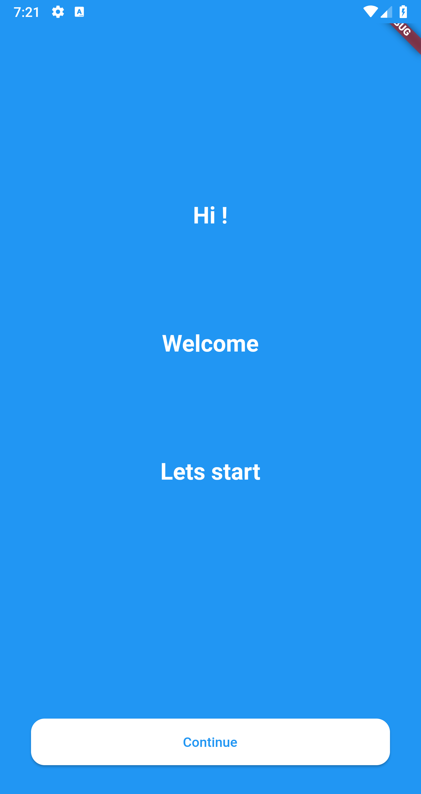
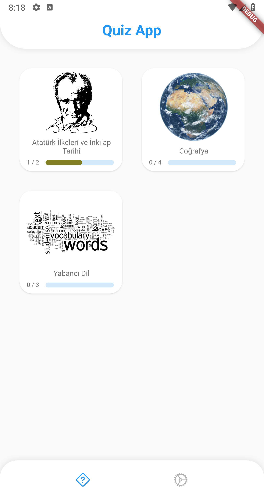
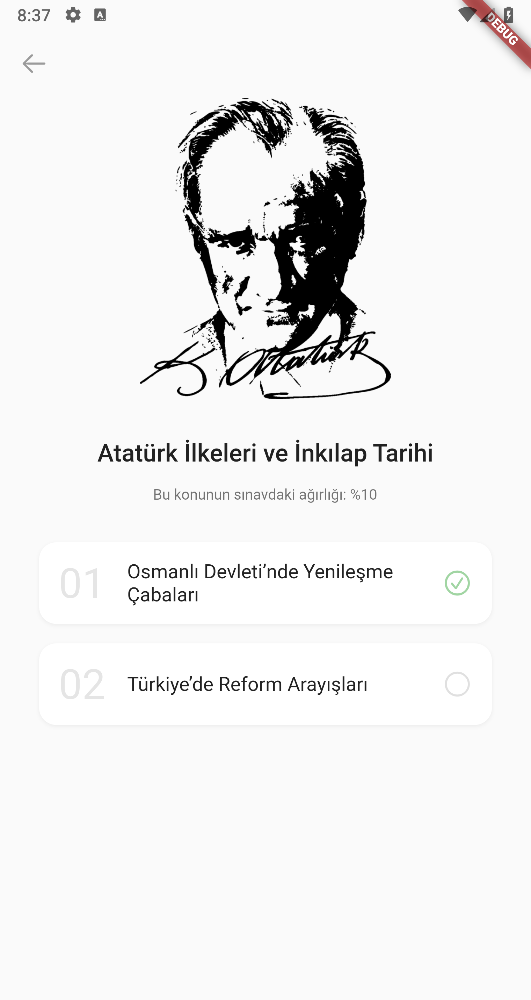
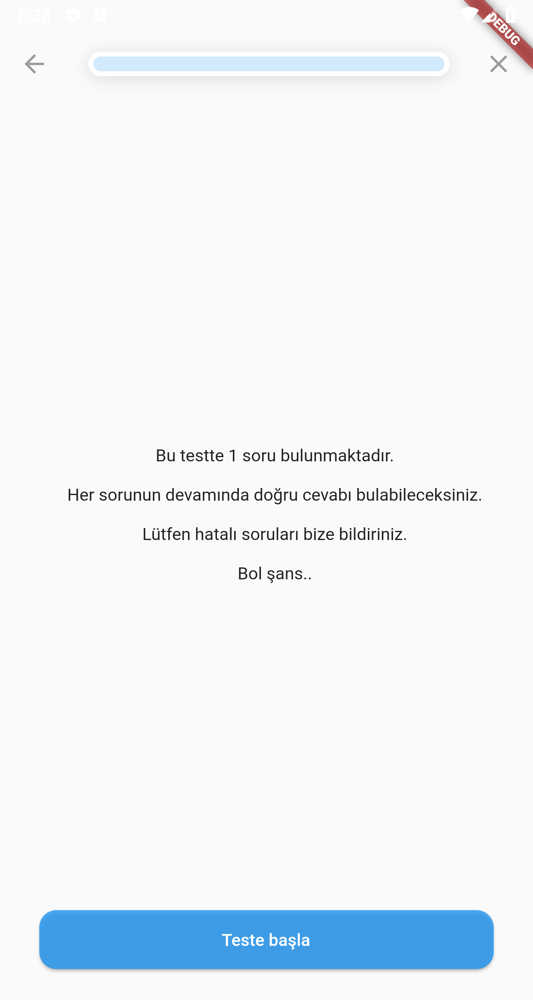
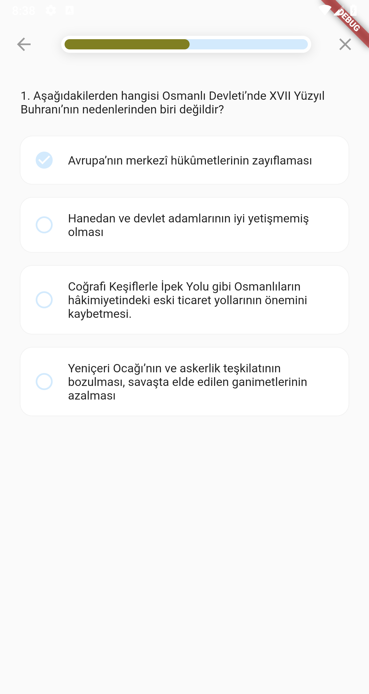
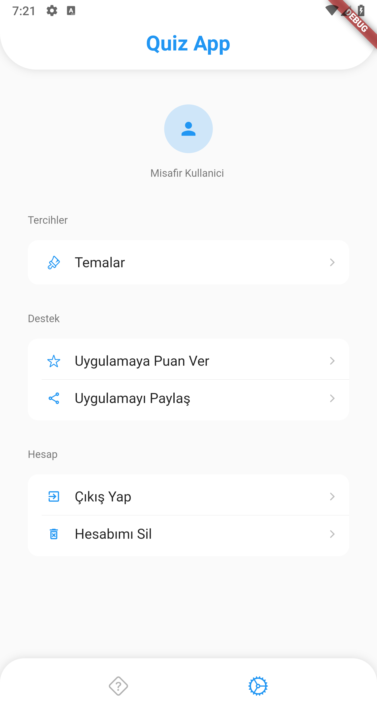

<!-- ABOUT THE PROJECT -->
# Quiz App

![version][version_badge]
[![flutter][flutter_badge]][flutter_link]
[![style: very good analysis][vga_badge]][vga_link]
![license: MIT][license_badge]

I am sharing the codes by updating the quiz application that I published before and earned me money. I hope it will be useful for those who are considering a similar application.

## Screenshots

     

## Architecture and Folder Structure

* Riverpod based architecture
* Test Driven Development
* Scalable and maintainable code
* Firebase Services module (custom package)
* Auth, Home, Topic, Quiz, Settings features
* Config layer for app configurations
* Core layer for third party packages and common data

## Major Packages

* firebase for backend
* riverpod for state management and service locator
* very_good_analysis for set of lints
* hive_flutter for local storage
* freezed and json_serializable for models
* auto_router for navigation
* easy_localization for localization
* flex_color_scheme for themes

## Progress

* [x] Add Firebase to the project
* [x] Create Firebase Services module and add auth service
* [x] Auth feature
* [x] Home, Topic, Quiz features
* [x] Settings feature
* [x] App navigation
* [ ] App localization
* [ ] App themes

<!-- CONTACT -->
## Contact

Ali Dinc - [@acdinc](https://twitter.com/acdinc) - alcmdnc@gmail.com

[version_badge]: https://img.shields.io/badge/version-0.0.1-orange

[flutter_badge]: https://img.shields.io/badge/flutter-3.3.7-blue
[flutter_link]: https://flutter.dev/

[vga_badge]:https://img.shields.io/badge/style-very_good_analysis-B22C89.svg
[vga_link]: https://pub.dev/packages/very_good_analysis

[license_badge]: https://img.shields.io/badge/license-MIT-blue.svg
